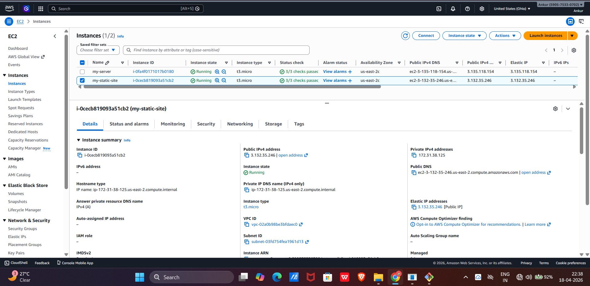
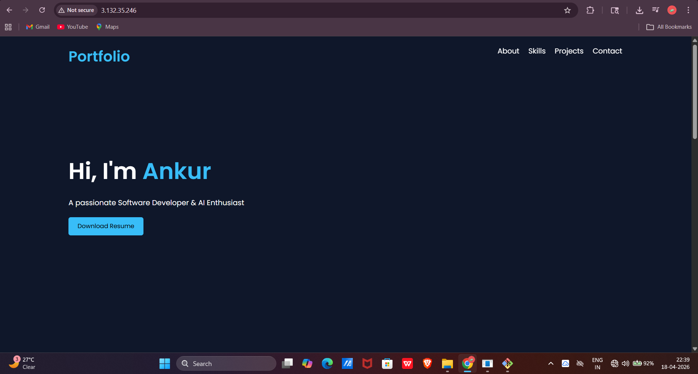
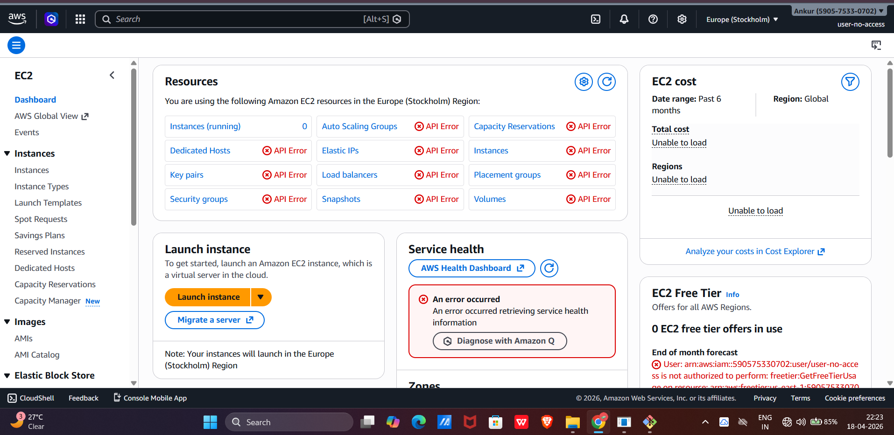
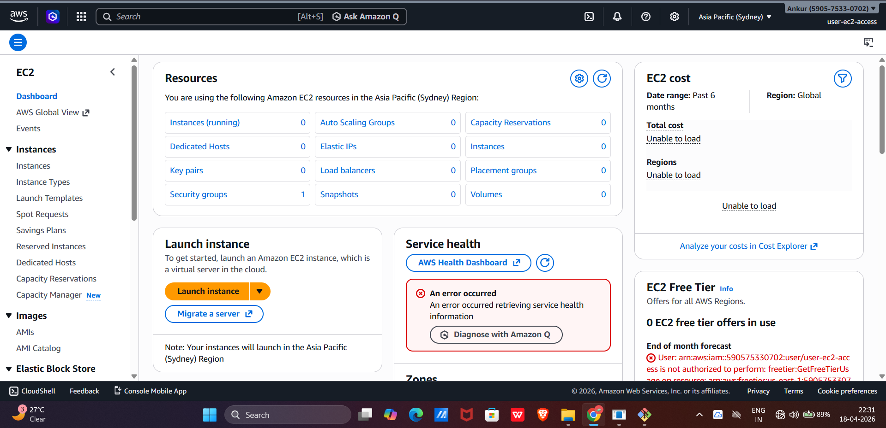

# AWS EC2 Static Website Hosting with IAM Access Control

## 🔗 Live Project
[
http://3.132.35.246/

---

## 📸 Screenshots

### EC2 Instance

### Website Running

### User 1 (No Access)

### User 2 (With Access)

---

## ⚙️ Steps Performed

1. Launched EC2 instance using AWS
2. Connected using SSH and installed Apache server
3. Hosted static website using HTML
4. Attached Elastic IP for permanent access
5. Created IAM users with different permissions:

   * User 1: No access
   * User 2: EC2 full access

---

## ⚠️ Challenges Faced

* SSH key permission issue (`chmod 400`)
* Understanding security group (HTTP port 80)
* Confusion between public IP and Elastic IP

---

## 🚀 Tech Stack

* AWS EC2
* Apache Server
* HTML/CSS
* IAM (Access Control)
